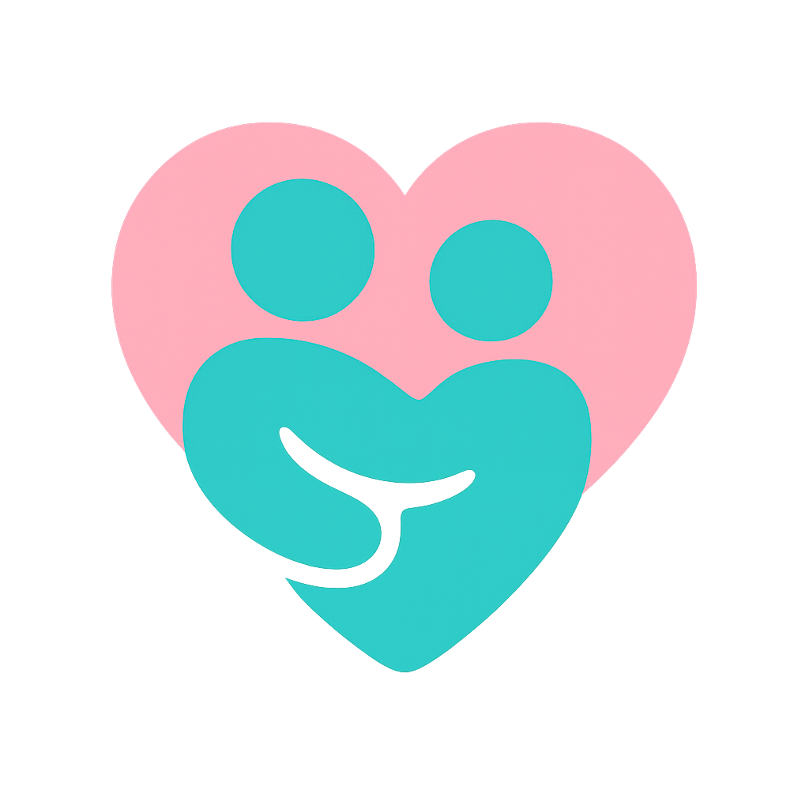

# 🌐 CareLink



- 치매 환자와 보호자를 위한 기억 유도 · 안전 관리 플랫폼이에요
- 환자의 기억 회상과 안전한 일상 생활을 도와요
- 보호자에게는 효율적인 관리 도구를 제공해요
- AI 기반 음성 합성 및 회상 문장과 퀴즈를 생성해요

---

# 📁 레포지토리 구조

```
CareLink/
├── ai-service/   # FastAPI 기반 AI 서비스 (회상 문장, 퀴즈, TTS)
├── backend/      # Node.js + Express 서버 (Firebase / MySQL 연동)
├── frontend/     # Kotlin(Android) 기반 환자/보호자 앱
└── README.md     # 메인 허브 문서
```
